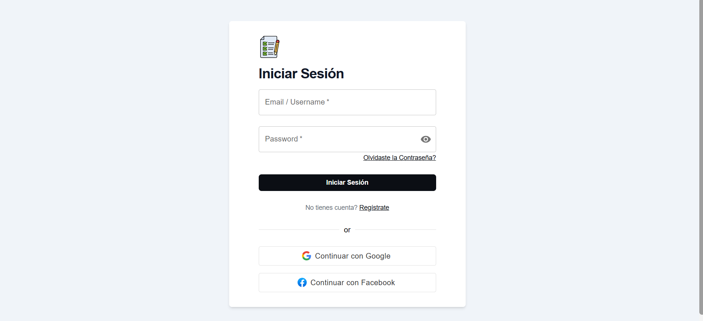
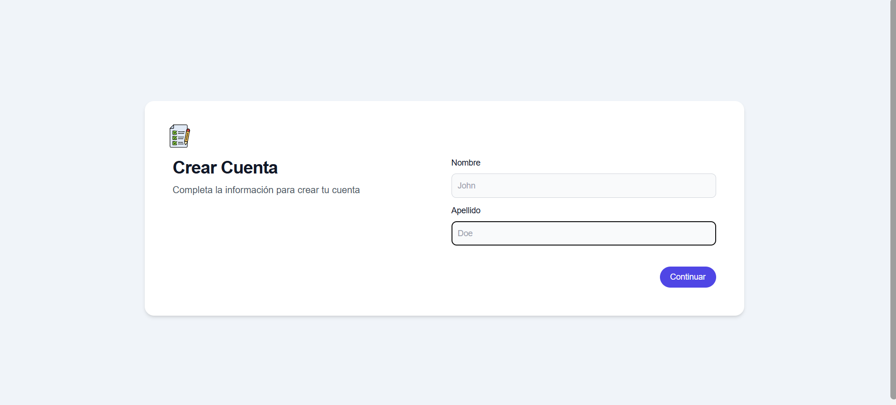
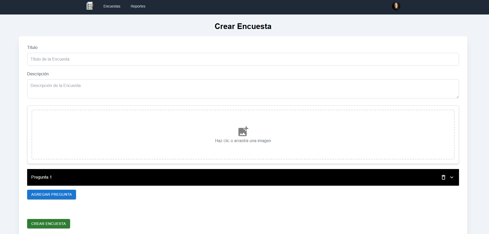
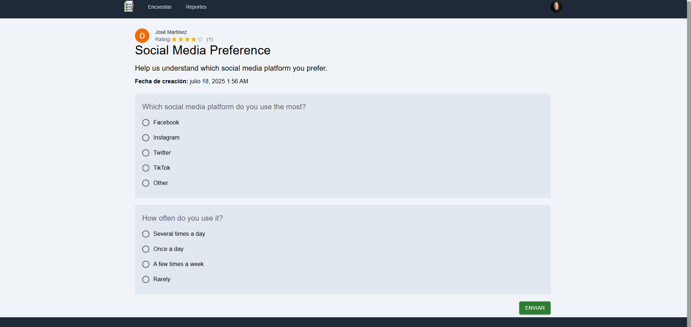
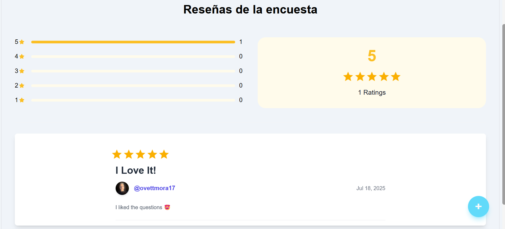
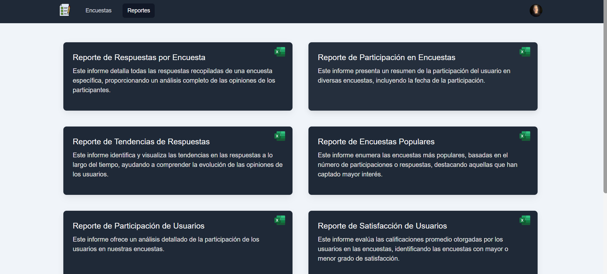
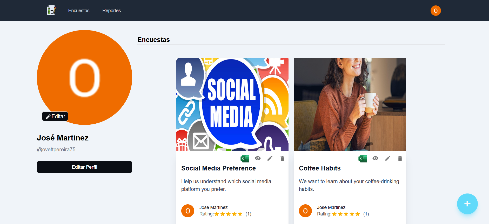

# 📝 SurveyHub – React + TypeScript + Vite

A full-featured **Survey Application UI** built with **React**, **TypeScript**, and **Vite**. SurveyHub provides a seamless experience for creating, managing, and participating in surveys, with authentication, reporting, reviews, and a modern responsive design.

---

## 🚀 Features

- ✅ User authentication (Login, Register, Account Activation)
- ✅ Create, edit, and delete surveys
- ✅ Participate in and answer surveys
- ✅ View survey results and reports
- ✅ Review and rating system for surveys
- ✅ Responsive design (Tailwind CSS + MUI)
- ✅ State management with React Context API
- ✅ Modular architecture (Auth, Survey, Reviews, Reports, Profile)

---

## 🛠️ Requirements

- **Node.js 18+**
- **npm 9+**

---

## 📦 Installation

### 1️⃣ Clone the Repository

```bash
git clone https://github.com/Ovtt17/survey-app-ui.git
cd survey-app-ui
```

---

### 2️⃣ Install Dependencies

```bash
npm install
```

---

### 3️⃣ Configure Environment Variables

Create a `.env` file in the root directory and add your environment variables:

```env
VITE_API_URL='http://localhost:8080/api/v1'
VITE_GOOGLE_OAUTH_URL='http://localhost:8080/api/v1/oauth2/authorization/google'
VITE_FACEBOOK_OAUTH_URL='http://localhost:8080/api/v1/oauth2/authorization/facebook'

```

---

### 4️⃣ Run the Application

```bash
npm run dev
```

The app will be available at:

```
http://localhost:5173
```

---

## 🧩 Modules

This project is divided into the following modules:

- **Auth:** Login, registration, and account activation
- **Survey:** Create, edit, delete, and answer surveys
- **Reviews:** Leave feedback and ratings for surveys
- **Reports:** View aggregated survey results and statistics
- **Profile:** Manage user profile and created surveys

---

## 🖼️ Screenshots

Below are screenshots of the main functionalities:

### Login

_Securely access the application with your credentials using a simple and intuitive login form._

### Registration (Stepper)

_Register a new account through a multistep form (stepper) similar to Google's registration process, making onboarding easy and user-friendly._

### Survey Creation

_Easily create new surveys with customizable questions and options._

### Answering Surveys

_Participate in surveys and submit your responses with a user-friendly interface._

### Reviews and Ratings

_Leave feedback and ratings for surveys to help improve the quality of future surveys._

### Survey Reports

_View detailed reports and analytics for each survey, including response statistics. **Note:** The section titles are in Spanish because the app was originally designed for Spanish-speaking users._

### User Profile

_Manage your profile, view your created surveys, and access your survey results._

---

## 👤 User Profile

Each authenticated user can:

- View and manage all their created surveys
- Edit or delete their surveys
- Access report summaries for each survey

---

## 🤝 Contributing

Want to help improve the app? Here's how:

1. Fork the repository
2. Create a new branch:
   ```bash
   git checkout -b feature/your-feature
   ```
3. Commit your changes:
   ```bash
   git commit -am 'Add new feature'
   ```
4. Push to your fork:
   ```bash
   git push origin feature/your-feature
   ```
5. Open a **Pull Request**

---

## 📄 License

This project is licensed under the [MIT License](LICENSE).

---

## 📬 Contact

For questions, ideas, or feedback, feel free to [open an issue](https://github.com/Ovtt17/survey-app-ui/issues).

---

## 🌐 API Backend

You can find and try the Survey App API (backend) here:

[Go to Survey App API](https://github.com/Ovtt17/survey-app-api)
